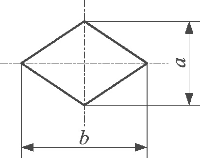
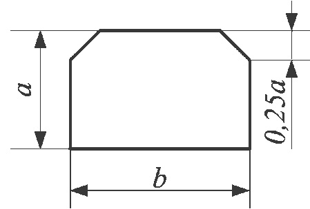
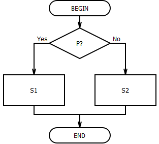

<!--
# 2019-09-21_lecture
-->

## Способы описания алгоритмов

Существует несколько способов описания алгоритмов.

Наиболее распространенными являются **словесное и графическое описание алгоритма**.

Словесное описание алгоритма (на естественном языке) рассмотрим на конкретном примере:

Рассмотрим алгоритм решения квадратного уравнения вида $ax^2+bx+c=0$:

1. вычислить $D=b^2-4ac$
2. если $D<0$, то перейти к 4,
3. вычислить $x_1={-b+ \sqrt{D}\over 2a}$, $x_2={-b- \sqrt{D}\over 2a}$
4. конец.

## Графическое описание алгоритма

Представление алгоритма в виде схемы, состоящей из последовательности блоков (геометрических фигур), каждый из которых отображает содержание очередного шага алгоритма, называется графическим описанием алгоритма.

Внутри фигур кратко записывают действие, выполняемое в этом блоке. Такую схему называют **блок-схемой алгоритма**.

Правила изображения фигур сведены в единую документации (ГОСТ 19.701-90). По данному ГОСТу - схема данных, которая отображает путь данных при решении задачи и определяет этапы обработки.

Схема данных содержит:

* символы данных (могут отображать тип носителя данных);
* символы процесса, который нужно выполнить над данными;
* символы линий, указывающих потоки данных между процессам и носителями данных, либо стрелок, если направление снизу вверх и справа налево;
* специальные символы, которые используются для удобства чтения схемы.

## Основные символы схемы алгоритма

* Символы ввода-вывода данных:

<table>
    <tr>
        <td style="width: 200px;"></td>
        <td></td>
    </tr>
    <tr>
        <td></td>
        <td>данные ввода / вывода (носитель не определён)</td>
    </tr>
    <tr>
        <td></td>
        <td>ручной ввод данных с устройства любого типа, например, с клавиатуры</td>
    </tr>
    <tr>
        <td></td>
        <td>отображение данных в удобочитаемой форме на устройстве, например, дисплее</td>
    </tr>
    <tr>
        <td></td>
        <td>документ. Ввод - вывод данных, носителем которых служит бумага</td>
    </tr>
</table>

**Примечание: Размер <u>а</u> должен выбираться из ряда 10, 15, 20 мм.**

**Допускается увеличивать размер <u>а</u> на число, кратное 5. Размер $b = 1.5a$.**

* Символы процесса:

<table>
    <tr>
        <td style="width: 200px;"></td>
        <td></td>
    </tr>
    <tr>
        <td></td>
        <td><b>процесс</b> - отображение функции обработки данных, т. е. операции приводящей к изменению значения указанного объекта</td>
    </tr>
    <tr>
        <td></td>
        <td><b>предопределённый процесс</b> - отображение группы операций, которые определены в другом месте, например, в подпрограмме</td>
    </tr>
    <tr>
        <td></td>
        <td><b>решение</b> - отображение функции, имеющей один вход и ряд альтернативных выходов, их которых только один может быть активизирован после анализа условия: указанного внутри этого символа</td>
    </tr>
    <tr>
        <td></td>
        <td><b>граница цикла</b> - отображение начала и конца цикла, или, наоборот, - условие завершения указывают в нижней границе</td>
    </tr>
</table>

## Основные символы схемы алгоритма

**Символы линий** - отображают поток данных или управления.

Линии - горизонтальные или вертикальные, имеющие только прямой угол перегиба.

Стрелки - указатели направления не ставятся, если управление идёт сверху вниз или слева-направо.

* Специальные символы

<table>
    <tr>
        <td style="width: 200px;"></td>
        <td></td>
    </tr>
    <tr>
        <td></td>
        <td><b>Соединитель</b> - используется при обрыве линии и продолжении её в другом месте (необходимо присвоить название)</td>
    </tr>
    <tr>
        <td></td>
        <td><b>Терминатор</b> - вход из внешней среды или выход во внешнюю среду (начало или конец схемы программы)</td>
    </tr>
    <tr>
        <td></td>
        <td><b>Коментарий</b></td>
    </tr>
</table>

## Применение простейшего линейного алгоритма

Наиболее часто в практике программирования требуется организовать расчёт которого арифметического выражения при различных исходных данных. Например, такого:

$z = {tg^2(x) \over \sqrt{x^2+m^2}}+x^{m+1} \sqrt{x^2+m^2}$, при

$x>0$ - вещественное,

m - целое.

Разработка алгоритма обычно начинается с составления схемы. Продумывается оптимальная последовательность вычислений, при которой, например, отсутствуют повторения. При написании алгоритма рекомендуется переменным присваивать те же имена, которые фигурируют в заданном арифметическом выражении, либо иллюстрируют их смысл.


Для того чтобы не было "длинных" операторов, исходное выражение полезно разбить на ряд более простых. В нашей задаче предлагается схема вычислений, представленная на рис.

Она содержит ввод и вывод исходных данных, линейный вычислительный процесс, вывод полученного результата. Заметим, что выражение $\sqrt{x^2+m^2}$ вычисляется только один раз, Введя дополнительные переменные а, b, с, мы разбили сложное выражение на ряд более простых выражений.

## Способы описания алгоритмов

Кроме словесного (на естественном языке) и графического описания алгоритма также иногда используют:

* псевдокод
* алгоритмический язык - запись на конкретном формальном языке (программа)

Псевдокод - представляет собой систему обозначений правил, предназначенную для единообразной записи алгоритмов. Псевдокод занимает промежуточное место между естественными и формальными языками. С одной стороны, он близок к обычному естественному языку, поэтому алгоритмы могут на нём записываться и читаться как обычный текст. С другой стороны, в псевдокоде используются некоторые формальные конструкции и математическая символика, что приближает запись алгоритма к общепринятой математической записи.

Пример линейного поиска на псевдокоде

```
function Max(a[1..n])
    maxi = 1
    for i = 2 to n do
        if a[i] > a[maxi] then
            maxi = i
    end for
    return maxi
end function
```

## Принципы построения алгоритмов при решении сложных задач

* принцип декомпозиции и синтеза. Первое предполагает первоначальную разработку алгоритма в виде укрепленных блоков и их постепенную детализацию. Затем проводится сборка блоков единую программу.
* Принцип "от главного к второстепенному" предполагает составление алгоритма, начиная с главной конструкции
* Принцип структурирования, т, е. использования только типовых алгоритмических структур (следования, логическая и циклическая)

## Типовые алгоритмические структуры

* следование
* ветвление
* повторение

Используя типовые алгоритмические структуры можно собрать алгоритм любой сложности.

## Ветвление

<table>
    <tr>
        <td style="width: 200px;"></td>
        <td></td>
    </tr>
    <tr>
        <td></td>
        <td>Команда ветвления - составная команда алгоритма, в которой в зависимости от условия Р выполняется или одно S1, или другое S2 действие. Из команд следования и команд ветвления составляются разветвляющиеся алгоритмы (алгоритмы ветвления). Примером разветвляющегося алгоритма будет нахождение большего из двух чисел, введенных клавиатуры.</td>
    </tr>
    <tr>
        <td></td>
        <td>Команда ветвления может быть полной и неполной формы. Неполная форма команды ветвления используется тогда, когда необходимо выполнять действие S только в случае соблюдения условия Р. Если условие Р не соблюдается, то команда ветвления завершает свою работу без выполнения действия. Примером команды ветвления неполной формы будет уменьшение в два раза только четного числа.</td>
    </tr>
</table>

## Повторение

<table>
    <tr>
        <td style="width: 200px;"></td>
        <td></td>
    </tr>
    <tr>
        <td></td>
        <td>Команда повторения - составная команда алгоритма, в которой в зависимости от условия Р возможно многократное выполнение действия S. Из команд следования и команд повторения составляются циклические алгоритмы (алгоритмы повторения). На рисунке представлена команда повторения с предусловием. Называется она так потому, что вначале проверяется условие, уже затем выполняется действие. Причем действие выполняется, пока условие соблюдается. Пример циклического алгоритма может быть следующий. Пока с клавиатуры вводятся положительные числа, алгоритм выполняет нахождение их суммы.</td>
    </tr>
    <tr>
        <td></td>
        <td>В команде повторения с постусловием вначале выполняется действие S и лишь затем, проверяется условие Р. Причем действие повторяется до тех пор, пока условие не соблюдается. Примером команды повторения с постусловием будет уменьшение положительного числа до тех пор, пока оно неотрицательное. Как только число становится отрицательным, команда повторения заканчивает свою работу.</td>
    </tr>
    <tr>
        <td></td>
        <td>Разновидностью команды повторения с предусловием является команда повторения с параметром. Она используется тогда, когда известно количество повторений действия. Примером циклического алгоритма с параметром будет нахождение суммы первых 20 натуральных чисел.</td>
    </tr>
</table>

## Немного истории

Алгоритмический язык С был разработан 1972 г. Денисом Ритчи на базе языка В (автор К. Томпсон), который в свою очередь основывался на языке системного программирования BCPL.

Первая версия языка была опубликована в книге авторов Д. Ритчи и Б, Кернигана и получила название стандарт K&R. Минимальная стандартная реализация, поддерживаемая любым компилятором, содержала всего 27 ключевых слов. Началось успешное развитие языка и чтобы избежать путаницы Американский институт стандартизации (American National Institute) ввел в 1983 г. общий стандарт языка - ANSI стандарт.

Язык продолжает развиваться и в 1985 г., появляется язык С++, который в основном сохраняет все черты обычного С, но дополнен новыми существенными возможностями, которые позволили реализовать объектно-ориентированный стиль программирования.

Достоинства:

* Язык С отражает возможности современных компьютеров.
* Программы на С отличаются компактностью и быстротой исполнения.
* Структура С побуждает программиста использовать нисходящее программирование, структурное программирование, пошаговую разработку модулей.
* Области применения языка С - системное программирование и прикладные задачи с жесткими требованиями скорости памяти.
* компактность и быстрота исполнения
* переносимость
* компилятор Си существует для 40 типов вычислительных систем
* мощный и гибкий
* удобный
