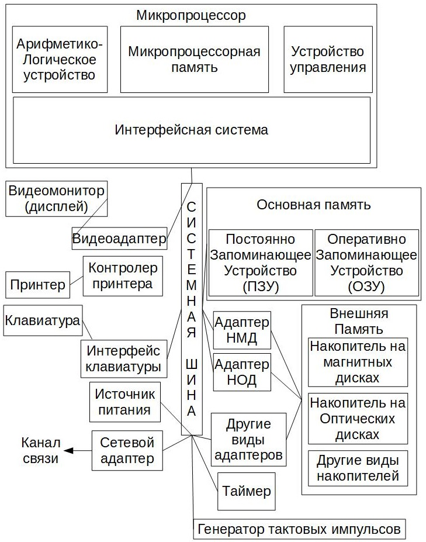

<!--
# 2019-09-07_lecture.marktext
-->

## История создания ЭВМ

* 1642 г. - Б. Паскаль - механическая счетная машина - сложение и вычитание 6-8 разрядных чисел
* 1670 г. - Г. В. Лейбниц - первый арифмометр, выполняющий все четыре арифметических действия
* 1834 г. - Ч. Бэббидж - предложил идею универсальной вычислительной машины с программным управлением. Её структура совпадала по существу со структурой современных ЭВМ. Программы для аналитической машины писала Ада Лавлейс (первый известный программист). На самом деле машина не была реализована в то время из-за технических и финансовых сложностей. Мир отставал от хода мыслей Бэббиджа.
* 1945 г. была создана первая ЭВМ в США
* в начале 70-ч годов - первые персональные ЭВМ (ПЭВМ)

## Функциональная схема ЭВМ

Еще при создании первых ЭВМ (1945) математик Джон фон Нейман описал, как должен быть устроен компьютер, чтобы он был универсальным и эффективным устройством для обработки информации.

Прежде всего, компьютер, согласно принципам фон Неймана, должен иметь следующие устройства:

* арифметико-логическое устройство, выполняющее арифметические и логические операции
* устройство управления, которое организует процесс выполнения программ
* запоминающее устройство, или память для хранения программы и данных
* внешнее устройство для ввода вывода информации

С помощью какого-либо устройства ввода в ЗУ вводится программа. УУ считывает содержимое ячейки памяти ЗУ, где находится первая команда, и организует её выполнение. Эта команда может задавать выполнение арифметических и логических операций над данными с помощью АЛУ, чтение из памяти данных для выполнения этих операций, вывод данных на устройство вывода и т. д. Затем выполняется вторая команда, третья и т. д. УУ выполняет инструкции программы автоматически. 

## Принципы фон Неймана

**Использование двоичной системы счисления в вычислительных машинах.** Преимущество перед десятичной системой счисления заключается в том, что устройство можно делать достаточно простыми, арифметические и логические операции в двоичной системе счисления также выполняются достаточно просто.

**Программное управление ЭВМ.** Работа ЭВМ контролируется программой, состоящей из набора команд. Команды выполняются последовательно друг за другом. Создание машины с хранимой в памяти программой было положено начало тому, что мы сегодня называем программированием.

**Память компьютера используется не только для хранения данных, но и программ.** При этом и команды и программы и данные кодируются в двоичной системе, т. е. их способ записи одинаков. Поэтому в определенных ситуациях над командами можно выполнять те же действия, что и над данными.

**Ячейки памяти ЭВМ имеют адреса, которые последовательно пронумерованы.** В любой момент можно обратиться к любой ячейке памяти по её адресу. Этот принцип открыл возможность использовать переменные в программировании.

**Возможность условного перехода в процессе выполнения программ.** Не смотря на то, что команды выполняются последовательно, в программах можно реализовать возможность перехода к любому участку кода.
Самым главным следствием этих принципов можно назвать то, что теперь программа уже не была постоянной частью машины (как, например, калькулятора). Программу стало возможно легко изменить. А вот аппаратура, конечно же, остается неизменной, и очень простой.

## Понятие компьютера

Компьютер - это техническое средство преобразования информации, в основу работы которого заложены те же принципы обработки электрических сигналов, что и в любом электронном устройстве:

* входная информация, представленная различными физическими процессами, как электрической, таки неэлектрической * природы (буквами, цифрами, звуковыми сигналами и т. д.), преобразуется в электрический сигнал;
  сигналы обрабатываются в блоке обработки;
* с помощью преобразователя выходных сигналов обработанные сигналы преобразуются в неэлектрические сигналы (изображение на экране).

## Поколение ПЭВМ

В короткой истории компьютерной техники выделяют несколько периодов на основе того, какие основные элементы использовались для изготовления компьютера. Временное деление на периоды в определённой степени условно, т. к. когда ещё выпускались компьютеры старого поколения, новое поколение начинало набирать обороты.

| Годы | Элементная база         | Быстродействие            | Программное обеспечение                                                       | Примечание                                | Примеры                                     |
| ---- | ----------------------- | ------------------------- | ----------------------------------------------------------------------------- | ----------------------------------------- | ------------------------------------------- |
| 50-е | Электронные лампы       | 10-20 тыс. оп/с           | Машинные языки                                                                | Расчетные задачи                          | ЭНИАК (США), МЭСМ (СССР)                    |
| 60-е | Полупроводники          | 100-500 тыс. оп/с         | Алгоритмические языки, диспетчерские системы, пакетный режим обработки данных | Инженерные, научные, экономические задачи | IBM 701 (США), БЭСМ-6, БЭСМ-4, НАИРИ (СССР) |
| 70-е | Интегральные микросхемы | Порядка 1 млн. оп/с       | Операционные системы, режим разделения времени                                | АСУ, САПР, научно-технические задачи      | IBM-360 (США), EC 1030, 1060 (СССР)         |
| 80-е | БИС, микропроцессоры    | Десятки и сотни млн. оп/с | Базы и банки данных                                                           | АРМ, обработка текстов, графика           | ПЭВМ                                        |
| 90-е | Сверх БИС               | Более 100 млрд. оп/с      | Глобальные всемирные сети                                                     | Управление, коммуникации                  | Сервера                                     |

## Первое поколение. Компьютеры на электронных лампах (194x-1955)

**Быстродействие:**

Несколько десятков тысяч операций в секунду.

**Особенности:**

Поскольку лампы имеют существенные размеры и их тысячи, то машины имели огромные размеры.

Поскольку ламп много и они имеют свойство перегорать, то часто компьютер простаивал из-за поиска и замены вышедшей из строя лампы.

Лампы выделяют большое количество тепла, следовательно, вычислительные машину требуют специальные мощные охладительные системы.

**Примеры компьютеров:**

**Колоссус** - секретная разработка британского правительства (в разработке принимал участие Алан Тьюринг). Это первый в мире электронный компьютер. Не оказал влияние на развитие компьютерной техники из-за своей секретности.

**Эниак.** Вес машины 30 тонн. Минусы: использование десятичной системы счисления; множество переключателей и кабелей.

**Эдсак.** Достижение: первая машина с программой памяти.

**Whirlwind I.** Слова малой длины, работа в реальном времени.

**Компьютер 701** (и последующие модели) фирмы IBM. Первый компьютер, лидирующий на рынке в течение 10 лет.

## Второе поколение. Компьютеры на транзисторах (1955-1965)

**Быстродействие:**

Сотни тысяч операций в секунду.

По сравнению с электронными лампами использование транзисторов позволило уменьшить размеры вычислительной техники, повысить надежность, увеличить скорость работы (до 1 млн. операций в секунду) и почти свести на нет. Развиваются способы хранения информации: широко используется магнитная пента, позже появляются диски. В этот период была замечена первая компьютерная игра.

Первый компьютер на транзисторах ТХ стал прототипом для компьютеров ветки PDP фирмы DEC, которые можно считать родоначальникам компьютерной промышленности, т. к. появилось явление массовой продажи машин. DEC выпускает первый миникомпьютер (размером со шкаф). Зафиксировано появление дисплея.

Фирма IBM также активно трудится, производя уже транзисторные версии своих компьютеров.

**Компьютер 6600** фирмы CDC, имел преимущество над другими компьютерами того времени - это его быстродействие, которое достигалось за счет
параллельного выполнения команд.

## Третье поколение. Компьютеры на интегральных схемах (1965-1980)

**Быстродействие:**

Миллионы операций в секунду.

Интегральная схема представляет собой электронную схему, вытравленную на кремниевом кристалле. На такой схеме умещаются тысячи транзисторов. Следовательно, компьютеры этого поколения были вынуждены стать ещё мельче, быстрее и дешевле.

Последнее свойство позволяло компьютерам проникать в различные сферы деятельности человека. Из-за этого они становились более специализированными (т.е. имелись различные вычислительные машины под различные задачи).

Появилась проблема совместимости выпускаемых моделей (программного обеспечения под них). Впервые большое внимание совместимости уделила кампания IBM.

Было реализовано мультипрограммирование (это когда в памяти находится несколько выполняемых программ, что дает эффект экономии ресурсов процессора).

Дальнейшее развитие миникомпьютеров (**PDP-11**).

## Четвертое поколение. Компьютеры на больших (и сверхбольших) интегральных схемах (1980-...)

**Быстродействие:**

Сотни миллионов операций в секунду.

Появилась возможность размещать на одном кристалле не одну интегральную схему, а тысячи. Быстродействие компьютеров увеличилось значительно. Компьютеры продолжали дешеветь и теперь их покупали даже отдельные личности, что ознаменовало так называемую эру персональных компьютеров. Но отдельная личность чаще всего не была профессиональным программистом. Следовательно, потребовалось развитие программного обеспечения, чтобы личность могла использовать компьютер в соответствие со своей фантазией.

В конце 70-х - начале 80-х популярностью пользовался компьютера **Apple**, разработанный Стивом Джобсом и Стивом Возняком. Позднее в массовое производство был запущен персональный компьютер **IBM PC** на процессоре Intel.

Позднее появились суперскалярные процессоры, способные выполнять множество команд одновременно, а также 64-битные компьютеры.

## Пятое поколение?

Сюда относят неудавшийся проект Японии (хорошо описан в Википедии). Другие источники относят к пятому поколения вычислительных машин так называемые невидимые компьютеры (микроконтроллеры, встраиваемые в бытовую технику, машину и др.) или карманные компьютеры.

Также существует мнение, что к пятому поколению следует относить компьютеры с двухъядерными процессорами. С этой точки зрения пятое поколение началось примерно с 2005 года.

## Структура современных ПЭВМ

На системной (материнской) плате размещаются:

* микропроцессор;
* генератор тактовых импульсов;
* микросхемы основной памяти;
* адаптеры клавиатуры, дисковых носителей;
* контроллер прерываний;
* таймер
* и др.

## Языки программирования

Для представления алгоритма в виде, понятном компьютеру, служат языки программирования - это искусственные языки.

Совокупность требований для записи команд образуют синтаксис языка, а смысл каждой команды - семантику языка.

Нарушение формы записи программы приводят к синтаксической ошибке, а правильно написанная программа, но не отвечающая алгоритму, приводит к семантической (логической) ошибке.

Процесс поиска ошибок в программе называют тестированием программы, процесс устранения ошибок - отладкой программы.

## Классификация языков программирования

1. По степени абстракции от архитектуры компьютера:
* языки программирования низкого уровня - машинный язык (язык машинных кодов). Используя такой язык, программист должен полностью владеть архитектурой ЭВМ;
* языки программирования среднего уровня - язык мнемонических кодов (язык ассемблера - символьная форма машинного языка с возможностями языков высокого уровня). Используя такие языки, необходимо владеть архитектурам ЭВМ, a также иметь специальную программу-переводчика инструкции пользовательской программы на язык машинных кодов, называемую транслятор;
* языки высокого уровня, или алгоритмические языки (Паскал, Алгол, Фортан, Си). Алгоритмические языки имеют свои алфавит и синтаксис, а также трансляторы со встроенной средой программирования, которая обладает развитыми средствами подготовки редактирования, отладки и выполнения программ. Инструкции программы на алгоритмическом языке записываются в виде операторов.
2. По структурному строению программ:
* **процедурно-ориентированные языки** (Pascal, C, и др.) - используется метод разбивки всей задачи на более простые подзадачи (процедуры или функции) и их независимая реализация. Достоинство - создание достаточно сложных программ.
* **объектно-ориентированные языки** (C++, Java, и др.) - из области решаемой выделяются классы, объединяющие связанные каким-либо признаком данных их обработке. Далее создаются объекты данных классов, которые взаимодействуя друг с другом, осуществляют решение поставленной задачи.
