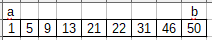
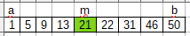
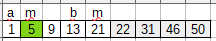
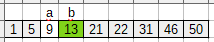

<!--
# 2019-11-16_lecture.marktext
-->

# Строки в языке Си

> В Си отдельного типа данных строки нет. Работа со строками реализована путем использования одномерных массивов типа char.

<u>Строка символов</u> — это одномерный массив типа char, заканчивающийся ненулевым байтом.

<u>Нулевой байт</u> — это байт, каждый бит которого равен нулю, при этом для нулевого байта определена символьная константа `\0` (признак окончания строки, или нуль-терминатор).

Если строка должна содержать $ k $ символов, то в описании массива необходимо указать $k + 1$ элемент.

```c
char a[7]; //означает, что строка может содержать шесть символов, а последний байт отведён под нулевой.
```

# Строковая константа

<u>Строковая константа</u> - это набор символов, заключенных в двойные кавычки.

Например:

```c
char S[] = "Работа состроками";
```

В конце строковой константы явно указывать символ `\0` не нужно.

При работе со строками удобно пользоваться указателями.

Например:

```c
char* x;
x = "БрГТУ"
```

<div style="page-break-after: always"></div>

# Ввод / вывод строк

- `scanf()` - вводит значение для строковых переменных спецификатором ввода `%s` до появления первого символа "пробел" (символ `&` перед ID строковых данных указывать не надо)

- `gets()` - ввод строки с пробелами внутри этой строки завершается нажатием клавиши ENTER

Обе функции автоматически ставят в конец строки нулевой байт.

Вывод строк производится функциями `printf()` или `puts()` до первого нулевого байта (`\0`).

- `printf()` - не переводит курсор после вывода на начало новой строки

- `puts()` - автоматически переводит курсор после вывода строковой информации в начало новой строки

Примеры:

```c
char Str[30];
printf("Введите строку без пробелов: \n");
scanf("%s", Str);
```

```c
puts("Введите строку");
gets(Str);
```

<div style="page-break-after: always"></div>

# Стандартная библиотека работы со строками

Описание прототипов стандартных библиотечных функций находятся в файле **string.h**

- Функция `int srtlen(char *S)` - возвращает длину строки (количество символом в строке), при этом завершающий нулевой байт не учитывается.
  
    Пример:
  
  ```c
    char* S1 = "Брест!\0",
          S2[] = "БрГТУ - Ура!";
    printf("%d, %d.", strlen(S1), strlen(S2));
  ```
  
    Результат выполнения данного участка программы:
  
  ```
    6, 10.
  ```

- Функция `strcpy(char *S1, char *S2)` - копирует содержимое строки S2 в строку S1.

- Функция `strcat(char *S1, char *S2)` - присоединяет строку S2 к строке S1 и помещает её в массив, где находилась строка S1, при этом строка S2 не изменяется. Нулевой байт, который завершал строку S1, заменяется первым символом строки S2.

- Функция `int strcmp(char *S1, char *S2)` - cравнивает строки S1 и S2 и возвращает значение
  
  - $ < 0 $, если S1 < S2;
  - $ > 0 $, если S1 > S2;
  - $ = 0 $, если строки равны, т. е. содержат одно и то же число одинаковых символов.

- Функция преобразования строки S в число:
  
  - целое `int atoi(char *S);`
  - длинное целое `long atol(char *S);`
  - действительное `double atof(char *S);`
    При ошибке данные функции возвращают значение 0.

- Функции преобразования числа V в строку S:
  
  - целое `itoa(int V, char *S, int kod);`
  
  - длинное целое `ltoa(long V, char *S, int kod);`
    
    2 <= kod <= 36,
    
    для отрицательных чисел:
    
    kod = 10.

Пример функции `del_c()`, в которой удаляется символ `'c'` из строки `S` каждый раз, когда он встречается:

```c
void del_c(char s[], int c) {
    int i, j;
    for (i = j = 0; s[i] != "\0"; i++)
        if (s[i] != c)
            s[j++] = s[i];
        s[j] = "\0";
}
```

<div style="page-break-after: always"></div>

# Поиск и сортировка

<div style="page-break-after: always"></div>

# Линейный поиск

Для обычного массива фрагмент программы, определяющий, имеет ли один из его элементов заданные значение, выглядит так:

```c
for (i = 0; i < n; i++)
    if (A[i] == B)
        break;
if (i != n)
    ...найден...
```

> Та часть элемента данных, которая индентифицирует его называется ключом.

> Остальная...

Поиск значения путем последовательного перебора всех элементов называется <u>линейным поиском</u>. Его трудоемкость в стреднем $T_{ср}(N) = {N \over 2}$. По статистике надо просмотреть половину последовательности (в худшем случае - всю).

Двоичный поиск в упорядоченных данных

> Если данные упорядочены, то найти интересующий элемент можно найти значительно быстрее.

Алгоритм <u>двоичного или бинарного поиска</u> основан на делении пополам текущего интервала поиска.

> В основе его лежит...

> мы можем определить справа или слева мы можем его искать.

Проще всего выбирать элемент на середине интервала, в котором производится поиск.

Основные идеи такого алгоритма:

- искомый интервал поиска делится пополами и по значению элемента массива в точке деления определяется, в какой части следует искать значение на следующий шаге цикла
- для выбранного интервала поиск повторяется
- при "сжатии" интервала в 0 поиск прекращается
- в качестве начального интервала выбирается весь массив.

Двоичный поиск в упорядоченном массиве

```c
int binary(int c[], int n, int val) { //Возвращает индекс найденного
    int a, b, m; //Левая, правая границы и
    for (a = 0, b = n - 1; a <= b;) { //середина
        m = (a + b) / 2; //Середина интервала
        if (c[m] == val) //Значение найдено -
            return m; //вернуть индекс найденного
        if (c[m] > val)
            b = m - 1; // выбрать левую половину
        else
            a = m + 1 //выбрать правую половину
    }
    return -1; //Значение не найдено
}
```

Двоичный поиск в упорядоченных данных

1. Упорядоченное по возврастанию множество элементов, необходимо найти элемент с значением, равным 9
   
    

2. Выбор середины вектора - элемента-границы
   
    

3. Сравнение элемента-границы с искомым элементом: 9 < 21, отбрасываем правую часть
   
    

4. В левой части повторяем алгоритм до тех пор, пока элемент-граница не равен 9
   
    
