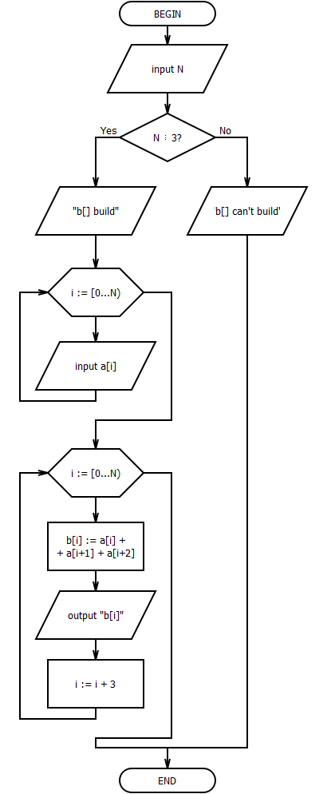
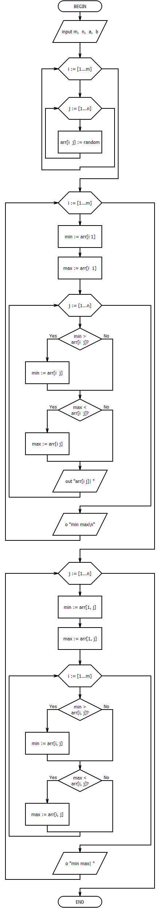
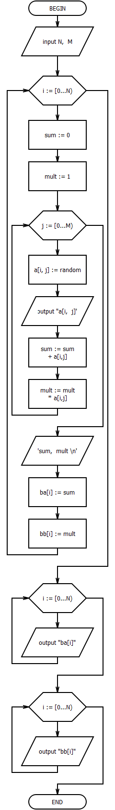

## Lab 7
- [Home](/README.md)
- [View code](main.c)

Задача А. Обработка векторов. Значения в массив вводятся с клавиатуры (если другое не указано в задании).

5. Задан массив А из N чисел. N – кратно 3. Это надо проверить. Образовать массив В из сумм каждой тройки чисел массива А.

Задача Б. Обработка многомерных массивов. Значения в массиве генерируются случайным образом (если другое не указано в задании).

5. Дан двухмерный массив A[1..m, 1..n]. Реализовать поиск минимального из максимальных элементов каждой строки матрицы и такой же поиск для столбцов.

7. Дан двухмерный массив A[1..N,1..M]. Написать программу построения одномерного массива B[1..N], элементы которого соответственно равны а) суммам элементов строк, б) произведениям элементов строк.

