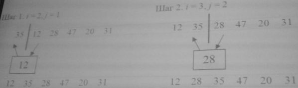

<!--
# 2019-11-23_lecture.marktext
-->

# Сортировка

> Задача сортировки является базовой задачей для поиска. Завершения проблем связанных сортировкой разработано множество алгоритмов.

<u>Сортировка</u> - это упорядочивание набора однотипных данных по возрастанию или убыванию.

Оценка алгоритмов сортировки:

- С кароль работы алгоритма сортировки.
  
  > Скорость работы связана с колическтвом сравнений и количество обмена между сортировкой, причем обмен занимает больше времени

- Время красоты лучшем и худшем случаях.
  
  > Имеет значение при анализе выполнения ситуаций будет встречаться довольно
  > часто.

- Поведение алгоритма сортировки.
  
  > Поведение называется естественым, если время сортировки является минимально для уже упорядолченного списка элементов. Увеличивается по мере возврастания степени не упорядочености и максимальна, когда элементы списка расположены в обратном порядке.
  
  > Простые действия, которые требуют n x n сравнений, где n - количество элементов массива. Если быстрые сортировки m x ln(n) сравнений. Простые они требуют методы удобны для сравнения методов сортировок. Сложные требуют малого числа операций, но сами операции очень сложные. Для не больших массивов простые методы более эффективны.
  
  > Простые методы можно разделить на 3 основных категорий
  > 
  > 1. Сортировка методом Пузырька (или простого обмена)
  > 2. Сортировка методом протоки вывода (ещё называют перебор)
  > 3. Сортировка методом простого исключения ()ещё называют вставки).

<div style="page-break-after: always"></div>

# Сортировка методом "пузырька"

> Самый известный метод Пузырьковая сортировка. Извесность объясняется её простотой алгоритма, но он худщий по быстродействию. Сортируются элементы медотом обмена. Алгоритмы содержит повторяющие сравнения и при необходимости обмен соседних элементов элементы ведут себя пузырьком воздуха в воде. Каждый поднимается на свой уровень.

```c
void buble(char *items, int count) {
    int a, b;
    char t;
    for (a = 1; a < count; ++a)
        for (b = count - 1; b >= a; --b)
            if (items[b - 1] > items[b]) {
                /* exchange elements */
                t = items[b - 1];
                items[b - 1] = items[b];
                items[b] = t;
            }
}
```

|          |     |     |     |     |
| -------- | --- | --- | --- | --- |
| Начало   | d   | c   | a   | b   |
| Проход 1 | a   | d   | c   | b   |
| Проход 2 | a   | b   | d   | c   |
| Проход 3 | a   | b   | c   | d   |

> `items` - указатель на массив символов подлежащей сортировки.

> `count` - количество элементов в массиве

> Работа пузырьковой сортировки выполняется в двух циклах.

> Внешний цикл приравнивается к просмотру массивов count - 1 раз. Это обеспечивает размещение элементов в правильном порядке к концу выполнения функции, даже во в худшем случае.

> Во внутре цикле выполняются все сравнения и обмена.

> В этом примере сортируем строку вводимую пользователем.

```c
#include <string.h>
#include <stdio.h>
#include <stdlib.h>

void buble (char *items, int count);

int main (void) {
    char s[255];
    printf("Введите строку:");
    gets(s);
    buble(s, strlen(s));
    printf("Отсортированная строка: %s. \n", s);

    return 0;
}
```

> Пузырьковая сортировке количество сравнений всегда одно и тоже поскольку два циклы for повторяется не зависимо от того был отсортирован или нет. Это означает, что

Алгоритм пузырьковой сортировки всегда выполняет $n^2 - n \over 2$ сравнений,

где `$ n $` - количество сортируемых элементов.

Данная формула выведена на том основании, что внешний цикл выполняется $n - 1$ раз, а внутренний выполняется в стреднем $n \over 2$ раз.

> А произведение величин даёт такую формулу.

> Порядок $n^2$ алгоритма не эффективен, при большом количестве элементов время сортировки сильно возврастает.

> Алгоритм пузырьковой сортировки всегда выполняет $n^2 - n \over 2$ сравнений,

> где `$ n $` - количество сортируемых элементов.

> Данная формулы введена на соновании ...

<div style="page-break-after: always"></div>

# Шейкер-сортировка

> Алгоритм пузырьковой сортировки можно улутшить потому, что не не упорядочены элементы на конце массива занимают правильное положение за 1 проход. Не упорядоченные элементы в начале массива поднимаются на своё место очень медленно.

> Поэтому способ для нею накакой вместо таго чтобы рассматривать в одном направлении, можно чередовать направления. Этим мы добъемся того, что элементы сильно удаленные от своего положения быстро встанут на свои места.

> Эту сортировку называют шейкерной, потому, что действия подобны
> сбалтыванию.

```c
/* Шейкер сортировка */
void shaker(char *items, int count) {
    int a;
    int exchange;
    char t;

    do {

        exchange = 0;
        for (d = count - 1; a > 0; --a)
            if (items[a - 1] > items[a]) {
                t = items[a - 1];
                items[a - 1] = items[a];
                items[a] = t;
                exchange = 1;
            }

        for (a = 1; a < count; ++a)
            if (items[a - 1] > items[a]) {
                t = items[a - 1];
                items[a - 1] = items[a];
                items[a] = t;
                exchange = 1;
            }

    } while(exchange); /* сортировка до тех пор, пока не будет обменов */
}
```

|               |       |       |       |       |
| ------------- | ----- | ----- | ----- | ----- |
|               | 4     | 2     | 2     | 2     |
|               | 9     | 3     | 3     | 3     |
|               | 7     | 4     | 4     | 4     |
|               | 6     | 7     | 6     | 6     |
|               | 2     | 6     | 7     | 7     |
|               | 3     | 9     | 9     | 9     |
| Номер прохода | i = 0 | i = 1 | i = 2 | i = 3 |

<div style="page-break-after: always"></div>

# Сортировка методом простого включения

<u>Сортировка методом простого включения</u> - это алгоритм последовательного помещения элемента места в отсортированиую честь в соответствии с ключом сортировки

Массив делят на части:

- отсортирования или "готовую" $a_1, ..., a_{n-1}$
- неотсортированную или "негодную" $a_1, ..., a_n$

В начале работы алгоритмы в качестве отсортированной части массива принимается только один первый элемент, а в качестве неотсортированной части - все остальные элементы.

На каком шаге, начинал с i = 2 и увеличивая каждый раз на 1, из неотеортированной последовательности извлекается i-й элемент и вставляется в отеоргированную так, чтобы не нарушить в ней упорядоченности элементов.

Каждый шаг алгоритма включает четыре действия:

1. Взять i-й элемент массива, он же является первым элементом в неотсортированной части, и сохранить его в дополнительной переменной.

2. Найти позицию j в отсортированной части массива, куда будет вставлен i-й элемент, значение которого теперь хранится в дополнительной переменной.
   
    Вставка этого элемента не должна нарушить упорядоченности элементов отсортироватной части массива.

3. Сдвиг элементов массива с позиции по j-ю на один элемент вправо, чтобы освободить напденную позшино для вставки.

4. Вставка взятого элемента в найденную j-ю позицию.



|       |     |     |     |     |     |     |
| ----- | --- | --- | --- | --- | --- | --- |
|       | 35  | 12  | 28  | 47  | 20  | 31  |
| i = 2 | 12  | 35  | 28  | 47  | 20  | 31  |
| i = 3 | 12  | 28  | 35  | 47  | 20  | 31  |
| i = 4 | 12  | 28  | 35  | 47  | 20  | 31  |
| i = 5 | 12  | 20  | 28  | 35  | 47  | 31  |
| i = 6 | 12  | 20  | 28  | 31  | 35  | 47  |

```c
//Описание функции сортировки методов простого включения
void InsertSort (int k, int x[max]) {
    int i, j, temp;
    for (i = 0; i < k; i++) {
        //цикл проходов, i - номер прохода
        temp = x[i];
        //поиск места элемента
        for (j = i - 1; j >= 0 && x[j] > temp; j--)
            x[j + 1] = x[j]; //сдвигаем элемент вправо, пока не дошли
        //место найдено, вставить элемент
        x[j + 1] = temp;
    }
}
```
