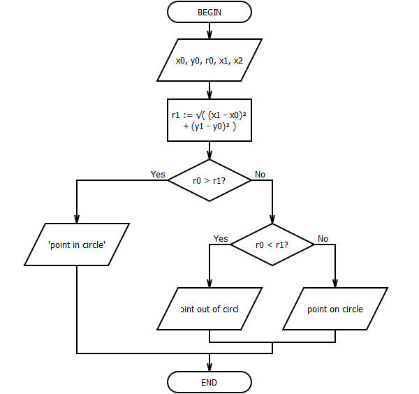

## Lab2

- [Home](/README.md)
- [View code](main.c)

5. Задан круг с центром в точке $O(x_0, y_0)$ и радиусом $R_0$ и точка $A(x_1, y_1)$. Определить месторасположение точки по отношению к кругу (находится внутри круга, вне его или лежит на окружности).

