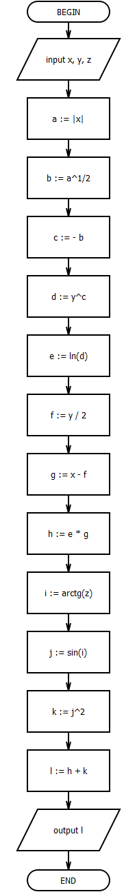
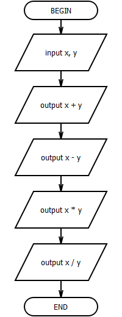

## Lab 4

- [Home](/README.md)
- [View code](main.c)

Задание выбирается согласно варианту (одно из группы А и одно из группы Б). Необходимо составить блок-схему линейного алгоритма по каждому заданию и написать программу для вычисления выражений на языке СИ.

Задание А

5. $ln(y^{-\sqrt{|x|}})(x - {{y} \over {2}}) + sin^2(arctg(z))$.

При $x = –15.246$,

$y = 4.642 * 10^{-2}$,

$z = 20.001 * 10^2$

: $–182.036$.

Задание B

5. Даны два действительных числа x и y. Вычислить их сумму, разность, произведение и частное.

