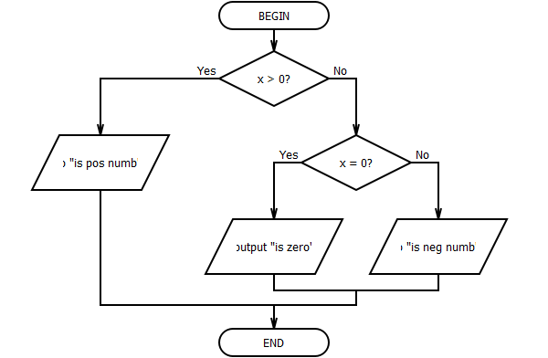
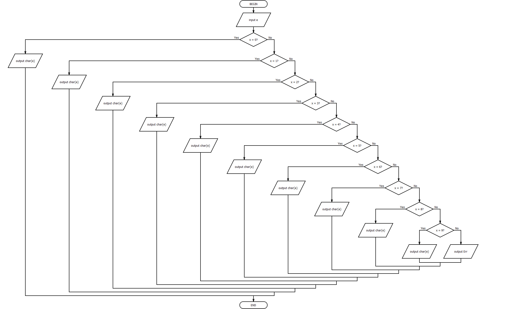
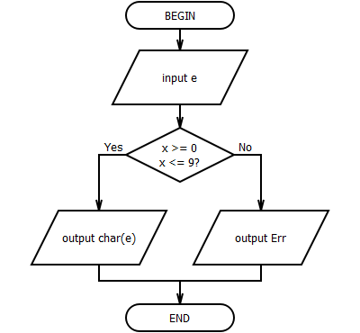

## Lab 5

- [Home](/README.md)
- [View code](main.c)

Задание A. Оператор if.

5. Написать программу проверки на положительность введенного числа

Задание B. Оператор switch.

5. Написать программу замены введенного числа от 0 до 9 соответствующим символом

Mode version:

